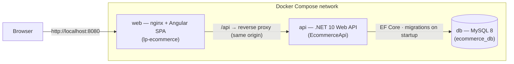
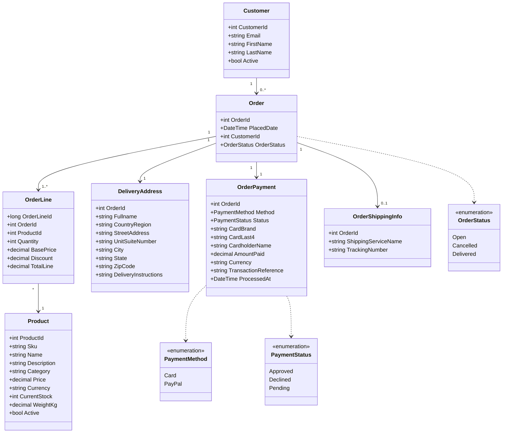

# LP E-Commerce — Code Challenge

A small e-commerce solution: an Angular storefront + admin site backed by a
.NET Web API and a MySQL database. All components are intended to run in Docker
containers.

| Component | Tech | Folder |
|-----------|------|--------|
| Web App / UI | Angular 21 (standalone components, signals) | [`lp-ecommerce/`](lp-ecommerce) |
| Backend API | .NET (layered, repository pattern) + EF Core | [`ecommerce-api/`](ecommerce-api) |
| Datastore | MySQL | (via EF Core migrations) |

Documentation is consolidated in this root README. Build/run steps are under
[Running with Docker](#running-with-docker-recommended) and
[Running locally](#running-locally-without-docker).

## Contents

- [Architecture](#architecture)
- [Decisions, approach & alternatives considered](#decisions-approach--alternatives-considered)
- [Scope & business rules](#scope--business-rules)
- [UI modules](#ui-modules)
- [API endpoints (summary)](#api-endpoints-summary)
- [Security](#security)
- [Running with Docker (recommended)](#running-with-docker-recommended)
- [Running locally (without Docker)](#running-locally-without-docker)

---

## Architecture

Three containers share a single Docker Compose network. The browser talks only to
nginx (the `web` container), which serves the Angular bundle and reverse-proxies
`/api` to the API container — so the SPA and API live on one origin (no CORS, and
the `httpOnly` auth cookie just works).



### Domain model

The order aggregate owns its delivery address, payment, optional shipping info,
and lines; a line references a product. Payment keeps only safe card metadata.



---

## Decisions, approach & alternatives considered

The requirements are intentionally open, so the guiding goal was a **small but
realistic vertical slice**: model the domain properly, keep each feature to the
simplest version that is still production-shaped, and leave clear seams where a
fuller implementation would slot in. Work was done decision-first and
incrementally — each rule below was a deliberate scoping choice, with the heavier
alternative noted and consciously deferred rather than missed.

| Area | Decision | Alternative considered (deferred) |
|------|----------|-----------------------------------|
| Solution shape | Layered .NET API (Domain / Application / Infrastructure / API) with the repository pattern + Angular SPA + MySQL | A single minimal-API project — rejected to keep boundaries explicit and testable |
| Container topology | Single origin: nginx serves the SPA and proxies `/api` to the API | Exposing the API on its own origin and calling it cross-site — avoided (CORS + cross-site-cookie complexity) |
| Stock tracking | One integer count on `Product` | An inventory-movement ledger (history, reporting) — out of scope |
| Currency | USD only, with a `Currency` field reserved on the model | Full multi-currency pricing — deferred; the field leaves the door open |
| Categories | Free-text field on `Product`; a distinct list is exposed for filtering | A dedicated category catalog/entity — deferred; fine for a small catalog |
| Customer | Minimal record keyed by **email**; delivery address captured per order | Customer accounts + saved-address profiles — no profile module in scope |
| Payments | Fake gateway that always approves; persist only **safe metadata** (brand, last 4, cardholder, amount, txn ref, timestamp) | A real/sandbox provider — unnecessary; instead modeled PCI-aware storage (never persist PAN / CVV / expiry) |
| Shipment cost | Not calculated | Deriving cost from weight × quantity × destination — deferred to keep the order model simple |
| Batch import — large files | Hard file-size cap | A background/async pipeline for large uploads — out of scope |
| Batch import — atomicity | **All-or-nothing**: any invalid row aborts the import and returns every problem row | Importing valid rows and skipping bad ones — rejected (decided during development) for predictable, reviewable uploads |
| Free products | Price `0.00` only; the literal word `free` is rejected | Accepting `free` as zero — rejected for consistency and less parsing ambiguity |
| Order identity & lifecycle | `OrderId` is the customer-facing number; statuses `Open` / `Cancelled` / `Delivered` | A separate opaque public order code — deferred (kept simple) |
| Order edits | Customers place + track only; **cancellation is admin-only** and restores stock for active products | Customer self-service cancel/edit — out of scope |
| Order tracking view | Public lookup returns a **privacy-minimal** projection (no full address/payment) | Returning the full order — rejected (PII exposure + order-number enumeration) |
| Auth | One admin user; BCrypt hash supplied via env vars/secrets (never committed); JWT in an `httpOnly`, `SameSite=Strict` cookie | JWT in `localStorage` / a full identity system — rejected (XSS exposure / out of scope). See [Security](#security) |
| Internationalization | English-only, UI structured for future translation | Full localization now — deferred |

The detailed, current behavior for each area is in [Scope & business rules](#scope--business-rules)
below; the security trade-offs (and what to change for real production) are in
[Security](#security).

---

## Scope & business rules

The challenge requirements are intentionally open. To keep the solution small,
the following rules and decisions were defined. (The sample product CSV was
downloaded on **June 14th, 2026**.)

### Products & inventory
- **SKU is unique** and validated as such.
- **Stock** is an integer held as a single count at the product level (no
  inventory-movement history in scope).
- **Prices are USD only**, but the model carries a `Currency` field to allow
  other currencies later.
- **Categories** are a simple free-text field on the product (no separate
  catalog). A distinct list is exposed for the storefront's category filter.
- **Free products are allowed**: a price of `0.00` is valid. The literal word
  `free` in the CSV is **rejected** with a message asking the user to replace it
  with `0.00`.

### Batch product upload (CSV)
- Expected columns: `name` (required), `sku` (required), `description`
  (optional), `category` (required), `price` (required), `stock`
  (required, integer ≥ 0), `weight_kg` (required, decimal ≥ 0).
- File size is limited (large-file background processing is out of scope).
- **All-or-nothing**: if any row is invalid, nothing is imported and every
  problem row is reported so the user can fix and re-upload. Fully-blank lines
  are skipped.
- **Price cleaning**: a leading `$` is stripped (e.g. `$29.99` → `29.99`).
  Thousands separators are intentionally not handled.
- **Field length limits** are enforced per row to match the DTO constraints:
  `sku` ≤ 50, `name` ≤ 200, `category` ≤ 100 characters. A violation fails the
  whole upload (all-or-nothing) with the offending line reported.
- **Duplicate SKUs**:
  - If the SKU already exists in the DB, its stock is increased by the values in
    the file (with a message to the user).
  - If a matching product was **previously deactivated**, the upload **reactivates**
    it and emits a distinct warning so the admin knows a soft-deleted product is
    live again.
  - If the SKU is new but repeated within the file, the product is created from
    the first occurrence and stock is accumulated across the repeats.

### Orders & customers
- A **minimal customer** is captured to place and look up orders; the customer
  **email is the unique identifier**. Customer-profile management is out of scope,
  so the **delivery address is captured with each order**.
- **Fake payment**: card details are collected in a form but never validated
  against a real gateway. The API only ever stores **safe metadata** — card
  brand, last 4 digits, cardholder name, amount, a generated transaction
  reference, and a timestamp. Full card number, CVV, and expiry are **never
  stored**. The fake gateway always approves.
- Shipment cost is not calculated (out of scope).
- A simple email notification to the customer is assumed (not a focus).
- **Order status**: `Open` (1), `Cancelled` (2), `Delivered` (3). The
  order id is the identifier shared with the customer. Customers can place and
  look up orders but **cannot cancel or edit** them.
- **Cancellation is admin-only** and allowed only from the `Open` state (a
  `Delivered` or `Cancelled` order can no longer change). Cancelling **returns the
  ordered quantities to inventory**, except for lines whose product is now
  **inactive** (soft-deleted) — those are skipped, since a deactivated product's
  stock is intentionally pinned at 0.

### Authentication
- A single **admin user** (username + password) guards the admin pages and the
  product/order management endpoints.
- The admin password is stored as a **BCrypt hash**, verified on login; a **JWT**
  is issued and required by admin endpoints.
- The JWT is delivered in an **`httpOnly`, `SameSite=Strict` cookie** (not the
  response body and not `localStorage`), so it is not readable by JavaScript and
  is hardened against XSS token theft. The browser attaches it automatically; the
  SPA sends API requests with `withCredentials`. Session state is restored on page
  load via `GET /api/auth/me`, and `POST /api/auth/logout` clears the cookie.
- No customer login: customers look up an order with their email + order id.
- See [Security](#security) for the full hardening notes and production caveats.

### Internationalization
- The demo is English-only, but the UI is built to allow future translations.

---

## UI modules

### Customer storefront (public)
- **Product list** — main page; live search by **product name and SKU**
  (transparent to the customer), a **category dropdown** (with an "All" =
  no-filter option), and **infinite scroll** (no page numbers).
- **Product detail** — image, category, name, description, SKU, weight; quantity
  selector capped to available stock; "Out of stock" disables add-to-cart.
- **Cart** — stored in the browser's local storage (not per-user on the server);
  shown in a slide-out pane. Before checkout, stock is re-validated: over-stock
  quantities are reduced and out-of-stock items removed, with the customer
  notified; if the cart empties, checkout stops.
- **Checkout flow** — Shipment (captures email + email confirmation and the
  delivery address; country is a free-text field) → fake Payment form → Order
  summary → Order complete (shows the order number). The search bar is hidden
  during checkout, and the logo returns to the main product page. The cart is
  emptied after a completed order. Card number, expiry, and ZIP use input masks;
  CVV is a hidden (password) field. Card masks support Visa/Mastercard (16-digit)
  and **Amex (15-digit)**.
- **Track order** — a public **"Track order"** entry next to the cart icon opens
  a lookup page (`/track-order`) where the customer enters the **email used at
  checkout + the order number**. On a match it shows a **read-only, privacy-minimal
  order view**: status, items, total, a coarse ship-to location (city/state/country),
  and tracking details once shipped. Full delivery address and all payment metadata
  are deliberately withheld, and there are no status-change controls. A wrong
  email/order combination returns the same "not found" message so order numbers
  can't be enumerated.
- **Service offline** — if the API can't be reached, the customer is redirected
  to a "service currently offline" page.

### Admin site (requires admin login)
- **Products** — list (id, name, price, current stock) with in-memory column
  sorting; edit any field except id/SKU/status; "delete" deactivates the product
  (soft delete — hidden from the storefront and the admin list). Deactivation goes
  through a **confirmation dialog** and **sets stock to 0**, so a later reactivation
  (e.g. via batch upload) never resurrects stale inventory. CSV batch upload has a
  confirm step and a success/warning/error message area; the file selection is
  cleared after each run to avoid accidental re-submission.
- **Orders** — list (id, placed date, total, customer name) with in-memory
  filters by **status (defaults to Open / not-yet-sent)**, id, customer name, and
  placed date; order detail shows full order info and lets the admin mark an
  order **Delivered**, capturing shipping service + tracking number. An `Open`
  order can also be **Cancelled** (via a confirmation dialog); cancelling returns
  in-stock items to inventory (active products only) and is irreversible.

---

## API endpoints (summary)

| Method | Route | Auth | Purpose |
|--------|-------|------|---------|
| POST | `/api/auth/login` | Public | Admin login → sets `httpOnly` JWT cookie (rate-limited) |
| GET | `/api/auth/me` | Admin | Restore session from cookie on page load |
| POST | `/api/auth/logout` | Public | Clear the auth cookie |
| GET | `/api/products` | Public | Paged list + filters (name, category, sku) |
| GET | `/api/products/categories` | Public | Distinct active categories |
| GET | `/api/products/{id}` | Public | Single product |
| POST | `/api/products` | Admin | Create (unique-SKU validation) |
| PUT | `/api/products/{id}` | Admin | Update (not SKU/status) |
| DELETE | `/api/products/{id}` | Admin | Deactivate (soft delete) |
| POST | `/api/products/batch-upload` | Admin | CSV upload |
| POST | `/api/orders` | Public | Create order (+ fake payment) |
| GET | `/api/orders` | Admin | Paged list + filters |
| GET | `/api/orders/{id}` | Admin | Single order (full detail) |
| GET | `/api/orders/validate` | Public | Check order exists by id + email |
| GET | `/api/orders/lookup` | Public | Customer order tracking by id + email → privacy-minimal view |
| PATCH | `/api/orders/{id}/status` | Admin | Update status (+ shipping when Delivered) |

---

## Security

The app applies several production-minded hardening measures, while deliberately
**leaving HTTPS enforcement off by default** because of how this challenge is
meant to be run.

### Deployment context for this challenge
This is a **technical demo** intended to be built and run with Docker on a
**local machine over plain HTTP** — there is no public domain and no TLS
certificate. Containers default to the `Production` environment, which is exactly
where naive "is this production?" hardening tends to break a local HTTP demo.

### Hardening that is always on
- **Auth token in an `httpOnly`, `SameSite=Strict` cookie** — not in
  `localStorage` and not in the response body, so it can't be read by JavaScript
  (XSS-resistant). `SameSite=Strict` also blocks CSRF for the admin endpoints. On
  `localhost` the cookie flows across ports because `SameSite`/site keys on the
  registrable domain and ignores the port.
- **Security response headers** on every API response: `X-Content-Type-Options:
  nosniff`, `X-Frame-Options: DENY`, `Referrer-Policy:
  strict-origin-when-cross-origin`, and `Content-Security-Policy: default-src
  'none'` (the API serves JSON only).
- **Login rate limiting** — a fixed window of 10 attempts/minute on
  `/api/auth/login` to slow brute-force attempts.
- **CORS allow-list** — only the configured `AllowedOrigins` may call the API,
  with credentials enabled so the auth cookie is accepted.
- **Parameterized data access** (EF Core) and **framework auto-escaping**
  (Angular interpolation) — the malicious sample rows in the test CSV (`<script>`
  and `'); DROP TABLE`) are stored and rendered as inert plain text.
- **Secrets via environment variables** in containers — JWT secret, admin BCrypt
  hash, and DB connection string are never committed.

### Decisions deliberately discarded for the demo (and why)
These would be correct in real production but **would silently break the local
HTTP demo**, so they are gated behind a single flag, `Security:RequireHttps`
(default `false`):

| Measure | Why it's off for the demo |
|---------|---------------------------|
| **HTTPS redirect** (`UseHttpsRedirection`) | There is no TLS listener on a local HTTP container; forcing a redirect to `https://` points at a port nothing serves, causing failed/looping requests. |
| **`Secure` flag on the auth cookie** | A container runs as `Production` by default. With `Secure=true` the browser **silently refuses to store/send the cookie over HTTP** — login would appear to succeed (200) but every admin call would then 401. This is the single most likely thing to break the demo, so the `Secure` flag tracks *“actually served over HTTPS”* (`Security:RequireHttps`), **not** the environment name. |
| **HSTS** (`Strict-Transport-Security`) | Browsers ignore it over HTTP anyway, and emitting it risks pinning HTTPS-only on a developer's `localhost` if the demo is ever hit once over HTTPS. |

### Recommendations for a real production deployment
When deploying behind a real domain and TLS, do the following:

1. **Set `Security__RequireHttps=true`** — this turns on the HTTPS redirect, HSTS,
   and the `Secure` cookie flag in one switch.
2. **Terminate TLS at a reverse proxy / load balancer** and add
   `app.UseForwardedHeaders()` (for `X-Forwarded-Proto` and `X-Forwarded-For`) so
   the app sees the real scheme and client IP. Without this, the HTTPS redirect
   and any IP-based logic misbehave behind a proxy.
3. **Partition the login rate limiter by client IP** (instead of the current
   single global window) so one abusive client can't lock out all admins — this
   depends on forwarded headers being configured first.
4. **If the SPA and API are served from different sites** (different registrable
   domains), change the cookie to `SameSite=None; Secure` — `Strict` would stop
   the browser from sending the cookie cross-site and break admin auth.
5. **Tighten CORS** to the exact production origin(s) and consider restricting
   allowed methods/headers rather than `AllowAnyHeader`/`AllowAnyMethod`.
6. **Add a global exception handler / ProblemDetails** so unexpected errors never
   leak internal details, and rotate the JWT secret and admin credentials.
7. **Use managed secrets** (a vault / orchestrator secret store) rather than
   plain environment variables, and run migrations as a deliberate deploy step
   rather than automatically on every container start (avoids multi-replica
   races).

---

## Running with Docker (recommended)

The whole stack runs with Docker Compose: a MySQL 8 database, the .NET API, and
the Angular app served by nginx. **Prerequisite:** Docker Desktop running.

```bash
cp .env.example .env      # demo secrets — works out of the box
docker compose up -d --build
```

Then open **http://localhost:8080**. That's it.

### What comes up

| Service | Image / build | Host port | Notes |
|---------|---------------|-----------|-------|
| `web`   | nginx + built Angular | **8080 → 80** | Serves the SPA and reverse-proxies `/api` to the API |
| `api`   | .NET 10 (multi-stage) | not exposed | Listens on `:8080` inside the network; EF Core migrations run on startup |
| `db`    | `mysql:8` | **3307 → 3306** | 3307 avoids clashing with a local MySQL on 3306; data persists in the `db-data` volume |

**Single-origin by design:** the SPA and API share the `http://localhost:8080`
origin (nginx proxies `/api`), so there's no CORS and the `httpOnly`/`SameSite=Strict`
auth cookie works without any cross-site handling. HTTPS hardening stays off for
this HTTP demo (see [Security](#security)).

### Configuration (`.env`)

Compose reads `.env` automatically. Defaults in `.env.example` are working demo
values; override for any real deployment.

| Variable | Purpose |
|----------|---------|
| `MYSQL_ROOT_PASSWORD` | MySQL root password (used by the healthcheck) |
| `MYSQL_DATABASE` | Database created on first run (`ecommerce_db`) |
| `MYSQL_USER` / `MYSQL_PASSWORD` | App DB account; injected into the API connection string |
| `AUTH_JWT_SECRET` | HMAC-SHA256 signing key (≥ 32 chars) |
| `AUTH_ADMIN_USERNAME` | Admin login username |
| `AUTH_ADMIN_PASSWORD_HASH` | BCrypt hash of the admin password — **each `$` must be doubled to `$$`** to escape Compose interpolation; the container receives the correct single-`$` hash |
| `WEB_ORIGIN` | SPA origin added to the API CORS allow-list |

### Setting your own admin password

The admin password is stored only as a **BCrypt hash** (work factor 11), verified
on login. To use your own password:

**1. Generate a hash.** With the .NET 10 SDK, create `genhash.cs`:

```csharp
#:package BCrypt.Net-Next@4.2.0
Console.WriteLine(BCrypt.Net.BCrypt.HashPassword(args[0], 11));
```

```bash
dotnet run genhash.cs -- 'YourNewPassword'
# → $2a$11$Xpz...
```

No .NET SDK? Either of these produces a compatible hash:

```bash
htpasswd -bnBC 11 "" 'YourNewPassword' | tr -d ':\n'                      # apache2-utils
python -c "import bcrypt; print(bcrypt.hashpw(b'YourNewPassword', bcrypt.gensalt(11)).decode())"
```

**2. Put it in `.env` with every `$` doubled to `$$`** (Compose interpolation escaping):

```dotenv
AUTH_ADMIN_USERNAME=admin
AUTH_ADMIN_PASSWORD_HASH=$$2a$$11$$Xpz...
```

**3. Recreate the API container** to pick up the new value (no rebuild needed):

```bash
docker compose up -d
```

Log in with `AUTH_ADMIN_USERNAME` and the plaintext password you hashed.

> The `$$` doubling applies **only** to `.env`. For a non-Docker run (user-secrets
> or `appsettings.Development.json`), use the raw single-`$` hash as
> `Auth:AdminPasswordHash`.

### Common operations

```bash
docker compose logs -f api      # follow API logs (migrations, requests)
docker compose down             # stop and remove containers (keeps the db volume)
docker compose down -v          # also drop the database volume (fresh DB next up)
```

The catalog/orders can also be reset without tearing down the volume using
[`ecommerce-api/scripts/truncate-tables.sql`](ecommerce-api/scripts/truncate-tables.sql)
against the DB on host port **3307**.

---

## Running locally (without Docker)

1. **Database** — a MySQL instance reachable on `localhost:3306` with a database
   and user. Provide the connection string and secrets via .NET user-secrets
   (`Auth:JwtSecret`, `Auth:AdminPasswordHash`, `ConnectionStrings:DefaultConnection`).
2. **Backend** — from `ecommerce-api`, run the API (defaults to
   `http://localhost:5048`); EF Core migrations are applied on startup.
3. **Frontend** — from `lp-ecommerce`, run `npx ng serve` (serves
   `http://localhost:4200`). The API's CORS already allows that origin, and the
   API base URL is configured in `src/environments/environment.ts`.
